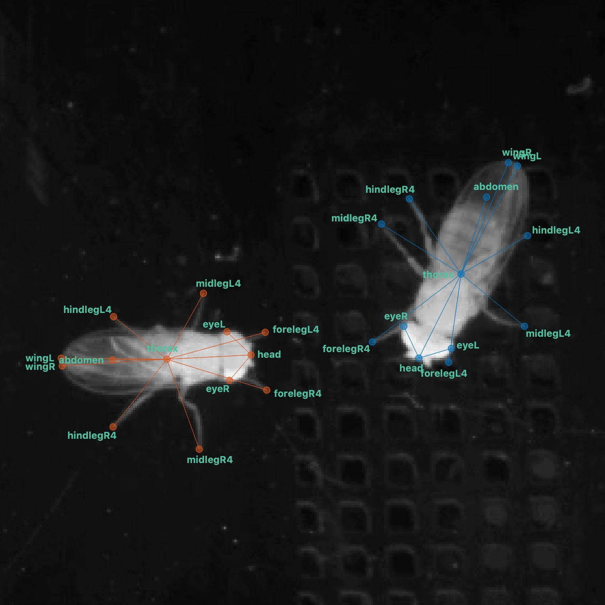

# SLEAP sample datasets

Sample datasets for using with [SLEAP](https://github.com/murthylab/sleap). You can download these datasets [here](https://github.com/murthylab/sleap-datasets/archive/master.zip).

## flies-pilot-gold

This dataset has 100 labeled frames (2 flies/frame) and 1101 frames in the movie.

